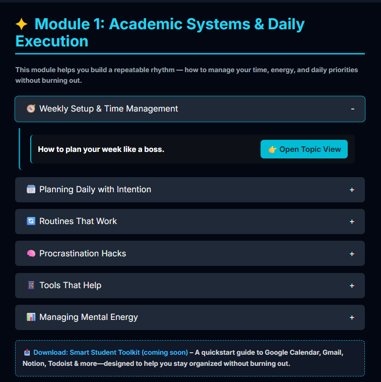

# 🎓 University Success Hub: Ditch the Cramming, Learn Smarter. Thrive.

Welcome to the University Success Hub — a student-centered, strategy-packed webpage designed to help you manage your academic life, build better habits, and avoid burnout.

## 🌟 What's Inside

This site breaks down academic success into actionable modules that help students stay focused, manage their energy, and study smarter.

### 📚 Modules Included

#### 🧭 Module 1: Academic Systems & Daily Execution
- Weekly Setup & Time Management
- Planning Daily with Intention
- Routines That Work
- Procrastination Hacks
- Tools That Help
- Managing Mental Energy

#### ✍️ Module 2: Note-Taking & Lecture Mastery *(Coming Soon)*
- Spot What Matters in Lectures
- Active vs. Passive Notes
- The 10-Minute Recap Trick
- Weekly Review Strategy
- Handwritten vs. Digital?
- Turn Notes into Study Tools
- Engaging in Class

#### 📖 Module 3: Studying & Essay Writing *(Coming Soon)*
- Study Smarter, Not Harder
- Understand the Assignment
- Build Essays that Flow
- Use Study Guides & Office Hours
- 3-Step Essay Review System

#### 🧠 Module 4: Emotional Mastery *(Coming Soon)*
- Fixed vs. Growth Mindset
- Identity Beyond Grades
- Ask for Help Without Shame
- Reduce Anxiety by Planning

## 🖼️ Preview



## 📁 File Structure

```plaintext
university-success-hub/
├── index.html               # Main HTML file
├── README.md                # This file
├── /screenshots/            # Contains preview images
└── /assets/                 # (Optional) For custom styles/scripts
```

## 💻 How to View It

1. Download or clone this repository.
2. Open `index.html` in any modern web browser.

No setup required — it’s 100% static!

## 🚧 Development Roadmap

- [x] Module 1: Academic Systems & Daily Execution
- [ ] Module 2: Note-Taking & Lecture Mastery
- [ ] Module 3: Studying & Essay Writing
- [ ] Module 4: Emotional Mastery

## 🙏 Acknowledgments

Inspired by my nephew Sean, who has worked hard and overcome huge obstacles to get into university. This project is for students like him.

## 📄 License

This project is licensed under the [MIT License](LICENSE). You are free to use, modify, and share this project with attribution.
